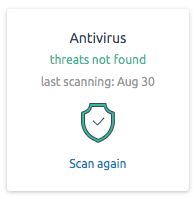
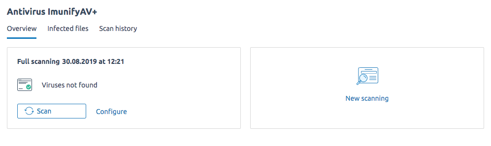
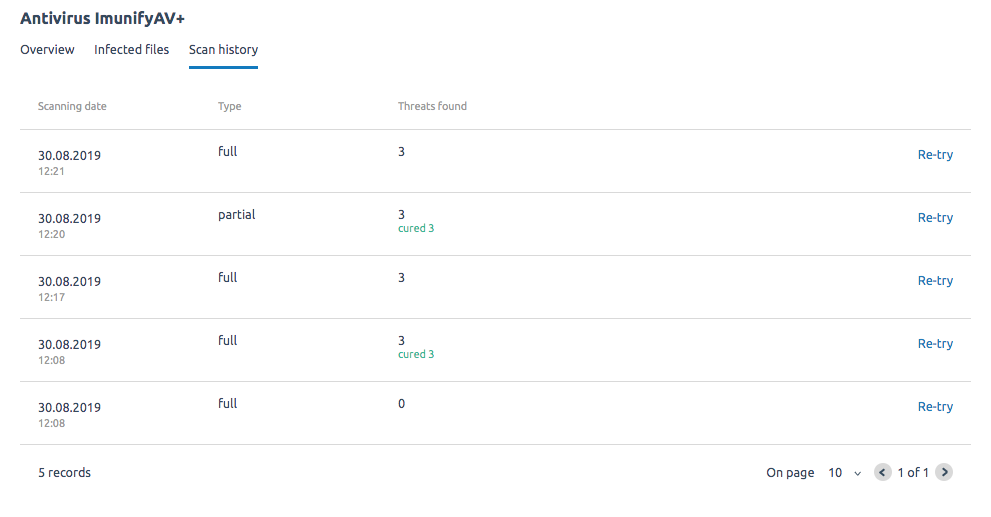

# Плагин ImunifyAV/ImunifyAV+ для Vepp

------

------

------

------

## Разработчикам

- Все коммиты оформляются по правилам коммитконвеншиона.

- На MR связанный с клиентской частью необходимо навешивать лейбл ~client, а на бэкендовский - ~server.

- [Клиентский интерфейс плагина](/client/README.md)

- [API плагина](/server/README.md)
