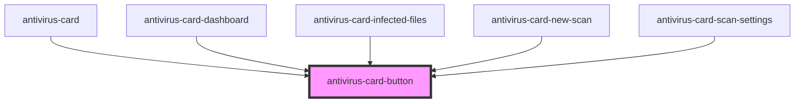

# antivirus-card-button

<!-- Auto Generated Below -->

## Properties

| Property         | Attribute          | Description | Type                                                                                                                 | Default                |
| ---------------- | ------------------ | ----------- | -------------------------------------------------------------------------------------------------------------------- | ---------------------- |
| `btnType`        | `btn-type`         |             | `ButtonType.button \| ButtonType.reset \| ButtonType.submit`                                                         | `ButtonType.button`    |
| `customCSSClass` | `custom-css-class` |             | `string`                                                                                                             | `''`                   |
| `isDisabled`     | `is-disabled`      |             | `boolean`                                                                                                            | `false`                |
| `theme`          | `btn-theme`        |             | `ThemePalette.accent \| ThemePalette.fourth \| ThemePalette.primary \| ThemePalette.secondary \| ThemePalette.third` | `ThemePalette.primary` |

## Dependencies

### Used by

 - [antivirus-card](..)
 - [antivirus-card-dashboard](../dashboard)
 - [antivirus-card-infected-files](../infected-files)
 - [antivirus-card-new-scan](../new-scan)
 - [antivirus-card-scan-settings](../scan-settings)

### Graph

----------------------------------------------

*Built with [StencilJS](https://stenciljs.com/)*
