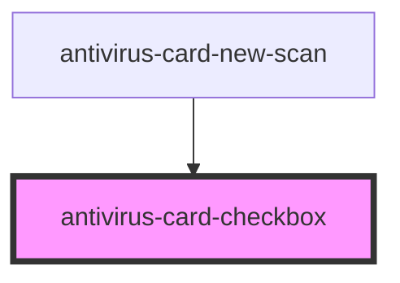

# antivirus-card-checkbox

<!-- Auto Generated Below -->

## Properties

| Property   | Attribute  | Description                         | Type      | Default     |
| ---------- | ---------- | ----------------------------------- | --------- | ----------- |
| `block`    | `block`    | Flag fore display type block        | `boolean` | `undefined` |
| `bold`     | `bold`     | Bold highlight active checkbox text | `boolean` | `undefined` |
| `checked`  | `checked`  | Value for checkbox                  | `boolean` | `undefined` |
| `readonly` | `readonly` | Make read only available            | `boolean` | `undefined` |
| `unwrap`   | `unwrap`   | Text wrapping around the checkbox   | `boolean` | `undefined` |

## Events

| Event     | Description                    | Type                   |
| --------- | ------------------------------ | ---------------------- |
| `changed` | Event by change checkbox value | `CustomEvent<boolean>` |

## Dependencies

### Used by

 - [antivirus-card-new-scan](../new-scan)

### Graph

----------------------------------------------

*Built with [StencilJS](https://stenciljs.com/)*
