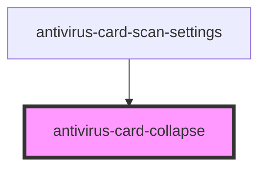

# antivirus-card-collapse

<!-- Auto Generated Below -->

## Properties

| Property            | Attribute | Description | Type                               | Default     |
| ------------------- | --------- | ----------- | ---------------------------------- | ----------- |
| `isOpen`            | `is-open` |             | `boolean`                          | `false`     |
| `text` _(required)_ | --        |             | `{ open: string; close: string; }` | `undefined` |

## Methods

### `toggle(value?: boolean) => Promise<void>`

#### Returns

Type: `Promise<void>`

## Dependencies

### Used by

 - [antivirus-card-scan-settings](../scan-settings)

### Graph

----------------------------------------------

*Built with [StencilJS](https://stenciljs.com/)*
