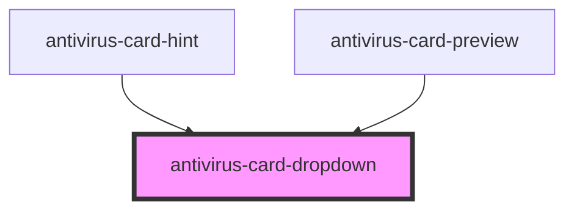

# antivirus-card-dropdown

<!-- Auto Generated Below -->

## Properties

| Property     | Attribute   | Description                                                            | Type          | Default                                    |
| ------------ | ----------- | ---------------------------------------------------------------------- | ------------- | ------------------------------------------ |
| `attachNode` | --          | Element for attaching dropdown component, by default is root component | `HTMLElement` | `document.querySelector('antivirus-card')` |
| `maxWidth`   | `max-width` | Max width for dropdown content                                         | `string`      | `'330px'`                                  |

## Methods

### `toggle(event: Event) => Promise<void>`

Toggle dropdown state

#### Returns

Type: `Promise<void>`

## Dependencies

### Used by

 - [antivirus-card-hint](../hint)
 - [antivirus-card-preview](../preview)

### Graph

----------------------------------------------

*Built with [StencilJS](https://stenciljs.com/)*
