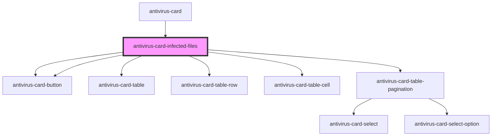

# antivirus-card-infected-files

<!-- Auto Generated Below -->

## Events

| Event          | Description | Type               |
| -------------- | ----------- | ------------------ |
| `openBuyModal` |             | `CustomEvent<any>` |

## Dependencies

### Used by

- [antivirus-card](..)

### Depends on

- [antivirus-card-button](../button)
- [antivirus-card-table](../table)
- [antivirus-card-table-row](../table-row)
- [antivirus-card-table-cell](../table-cell)
- [antivirus-card-table-pagination](../table-pagination)
- [antivirus-card-button](../button)

### Graph

---

_Built with [StencilJS](https://stenciljs.com/)_
