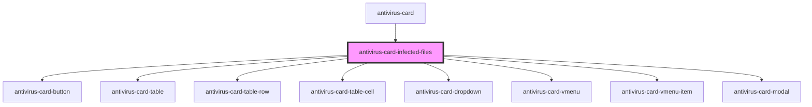

# antivirus-card-infected-files

<!-- Auto Generated Below -->

## Events

| Event          | Description | Type               |
| -------------- | ----------- | ------------------ |
| `openBuyModal` |             | `CustomEvent<any>` |

## Methods

### `openDeletionModal(ev: MouseEvent) => Promise<boolean>`

#### Returns

Type: `Promise<boolean>`

## Dependencies

### Used by

 - [antivirus-card](..)

### Depends on

- [antivirus-card-button](../button)
- [antivirus-card-table](../table)
- [antivirus-card-table-row](../table-row)
- [antivirus-card-table-cell](../table-cell)
- [antivirus-card-dropdown](../dropdown)
- [antivirus-card-vmenu](../vmenu)
- [antivirus-card-vmenu-item](../vmenu-item)
- [antivirus-card-modal](../modal)

### Graph

----------------------------------------------

*Built with [StencilJS](https://stenciljs.com/)*
