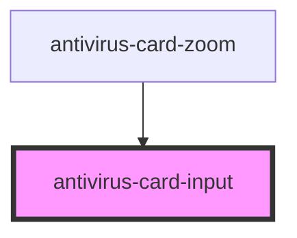

# antivirus-card-input

<!-- Auto Generated Below -->

## Properties

| Property      | Attribute      | Description                  | Type                                       | Default     |
| ------------- | -------------- | ---------------------------- | ------------------------------------------ | ----------- |
| `disabled`    | `disabled`     | Flag for disable input field | `boolean`                                  | `undefined` |
| `inlineBlock` | `inline-block` |                              | `boolean`                                  | `undefined` |
| `placeholder` | `placeholder`  | Value for input placeholder  | `string`                                   | `undefined` |
| `validator`   | --             | List of custom validators    | `Validator<string> \| Validator<string>[]` | `undefined` |
| `value`       | `value`        | Value for input field        | `string`                                   | `undefined` |

## Events

| Event     | Description                   | Type                  |
| --------- | ----------------------------- | --------------------- |
| `changed` | Event for input value changed | `CustomEvent<string>` |

## Dependencies

### Used by

 - [antivirus-card-zoom](../zoom)

### Graph

----------------------------------------------

*Built with [StencilJS](https://stenciljs.com/)*
