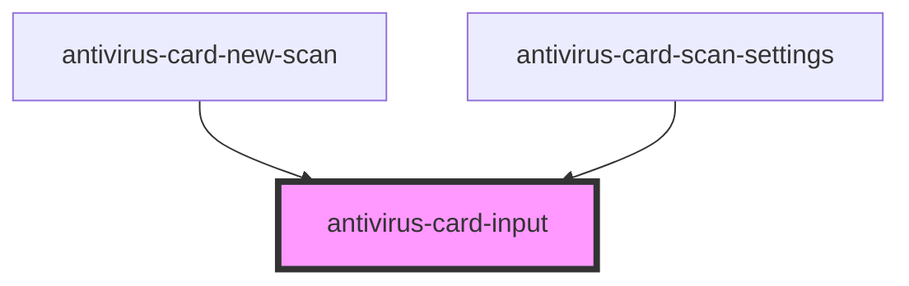

# antivirus-card-input

<!-- Auto Generated Below -->

## Properties

| Property      | Attribute     | Description                  | Type                                       | Default     |
| ------------- | ------------- | ---------------------------- | ------------------------------------------ | ----------- |
| `disabled`    | `disabled`    | Flag for disable input field | `boolean`                                  | `undefined` |
| `placeholder` | `placeholder` | Value for input placeholder  | `string`                                   | `undefined` |
| `textPrefix`  | `text-prefix` | Text prefix                  | `string`                                   | `undefined` |
| `type`        | `type`        | Input type in HTML format    | `"number" \| "text"`                       | `'text'`    |
| `validator`   | --            | List of custom validators    | `Validator<string> \| Validator<string>[]` | `undefined` |
| `value`       | `value`       | Value for input field        | `string`                                   | `undefined` |
| `width`       | `width`       | Style width for input field  | `string`                                   | `'280px'`   |

## Events

| Event     | Description                   | Type                  |
| --------- | ----------------------------- | --------------------- |
| `changed` | Event for input value changed | `CustomEvent<string>` |

## Dependencies

### Used by

 - [antivirus-card-new-scan](../new-scan)
 - [antivirus-card-scan-settings](../scan-settings)

### Graph

----------------------------------------------

*Built with [StencilJS](https://stenciljs.com/)*
