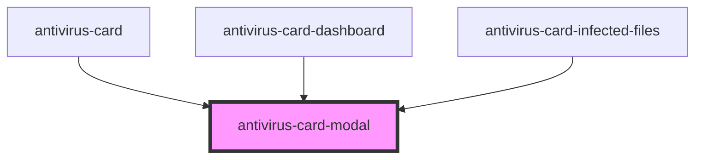

# antivirus-card-modal

<!-- Auto Generated Below -->

## Properties

| Property        | Attribute         | Description                | Type      | Default     |
| --------------- | ----------------- | -------------------------- | --------- | ----------- |
| `maxModalWidth` | `max-modal-width` | Modal max width            | `string`  | `undefined` |
| `modalWidth`    | `modal-width`     | Modal width                | `string`  | `undefined` |
| `visible`       | `visible`         | Flag for visible component | `boolean` | `undefined` |

## Methods

### `toggle(value?: boolean) => Promise<void>`

Method for change modal visible

#### Returns

Type: `Promise<void>`

## Dependencies

### Used by

 - [antivirus-card](..)
 - [antivirus-card-dashboard](../dashboard)
 - [antivirus-card-infected-files](../infected-files)

### Graph

----------------------------------------------

*Built with [StencilJS](https://stenciljs.com/)*
