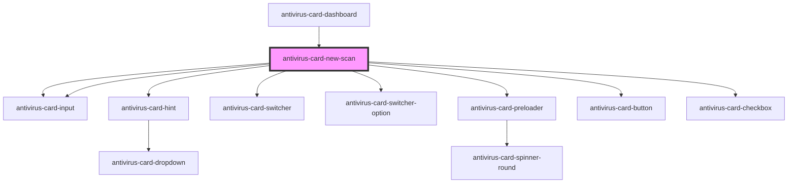

# antivirus-card-new-scan

<!-- Auto Generated Below -->

## Properties

| Property              | Attribute | Description                 | Type                  | Default          |
| --------------------- | --------- | --------------------------- | --------------------- | ---------------- |
| `closeModal`          | --        | Function on modal close     | `() => Promise<void>` | `async () => {}` |
| `preset` _(required)_ | --        | Model settings for new scan | `ScanOption`          | `undefined`      |

## Dependencies

### Used by

 - [antivirus-card-dashboard](../dashboard)

### Depends on

- [antivirus-card-input](../input)
- [antivirus-card-hint](../hint)
- [antivirus-card-switcher](../switcher)
- [antivirus-card-switcher-option](../switcher-option)
- [antivirus-card-preloader](../preloader)
- [antivirus-card-button](../button)
- [antivirus-card-checkbox](../checkbox)
- [antivirus-card-input](../input)

### Graph

----------------------------------------------

*Built with [StencilJS](https://stenciljs.com/)*
