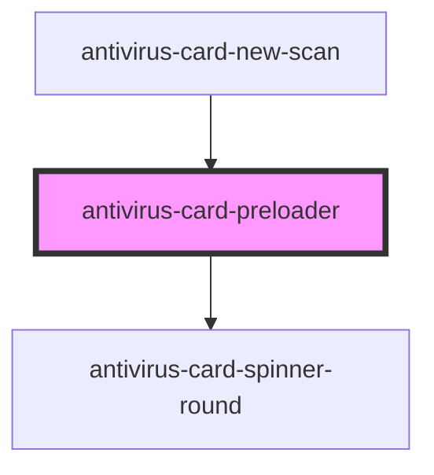

# antivirus-card-preloader

<!-- Auto Generated Below -->

## Properties

| Property  | Attribute | Description                | Type                              | Default     |
| --------- | --------- | -------------------------- | --------------------------------- | ----------- |
| `height`  | `height`  | Value for css style height | `string`                          | `'100%'`    |
| `left`    | `left`    | Value for css style left   | `string`                          | `'0'`       |
| `loading` | `loading` | Flag for loading           | `boolean`                         | `false`     |
| `size`    | `size`    | Spinner size type          | `"large" \| "medium" \| "small"`  | `undefined` |
| `top`     | `top`     | Value for css style top    | `string`                          | `'0'`       |
| `type`    | `type`    | Preloader type             | `"fixed" \| "local" \| "overlay"` | `'local'`   |
| `width`   | `width`   | Value for css style width  | `string`                          | `'100%'`    |

## Dependencies

### Used by

 - [antivirus-card-new-scan](../new-scan)

### Depends on

- [antivirus-card-spinner-round](../spinner-round)

### Graph

----------------------------------------------

*Built with [StencilJS](https://stenciljs.com/)*
