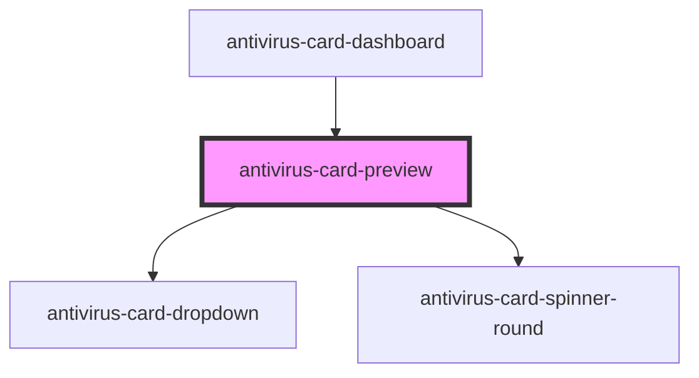

# antivirus-card-start-check

<!-- Auto Generated Below -->

## Properties

| Property   | Attribute   | Description             | Type                  | Default  |
| ---------- | ----------- | ----------------------- | --------------------- | -------- |
| `scanType` | `scan-type` | scan type for this card | `"FULL" \| "PARTIAL"` | `'FULL'` |

## Events

| Event          | Description                                   | Type               |
| -------------- | --------------------------------------------- | ------------------ |
| `clickItem`    | to change selected tab item (horizontal menu) | `CustomEvent<any>` |
| `openBuyModal` | to open buy modal                             | `CustomEvent<any>` |

## Dependencies

### Used by

 - [antivirus-card-dashboard](../dashboard)

### Depends on

- [antivirus-card-dropdown](../dropdown)
- [antivirus-card-spinner-round](../spinner-round)

### Graph

----------------------------------------------

*Built with [StencilJS](https://stenciljs.com/)*
