# antivirus-card

<!-- Auto Generated Below -->

## Properties

| Property           | Attribute | Description                      | Type                                                                                               | Default     |
| ------------------ | --------- | -------------------------------- | -------------------------------------------------------------------------------------------------- | ----------- |
| `notifier`         | --        | global notifier object           | `Notifier`                                                                                         | `undefined` |
| `siteId`           | `site-id` | site ID from vepp                | `number`                                                                                           | `undefined` |
| `translateService` | --        | main app translate service       | `{ currentLang: string; defaultLang: string; onLangChange: Observable<{ lang: "ru" \| "en"; }>; }` | `undefined` |
| `userNotification` | --        | Global user notification service | `UserNotification`                                                                                 | `undefined` |

## Dependencies

### Depends on

- [antivirus-card-dashboard](dashboard)
- [antivirus-card-infected-files](infected-files)
- [antivirus-card-history](history)
- [antivirus-card-spinner-round](spinner-round)
- [antivirus-card-navigation](navigation)
- [antivirus-card-modal](modal)
- [antivirus-card-button](button)

### Graph

```mermaid
graph TD;
  antivirus-card --> antivirus-card-dashboard
  antivirus-card --> antivirus-card-infected-files
  antivirus-card --> antivirus-card-history
  antivirus-card --> antivirus-card-spinner-round
  antivirus-card --> antivirus-card-navigation
  antivirus-card --> antivirus-card-modal
  antivirus-card --> antivirus-card-button
  antivirus-card-dashboard --> antivirus-card-button
  antivirus-card-dashboard --> antivirus-card-preview
  antivirus-card-dashboard --> antivirus-card-modal
  antivirus-card-dashboard --> antivirus-card-new-scan
  antivirus-card-dashboard --> antivirus-card-scan-settings
  antivirus-card-preview --> antivirus-card-dropdown
  antivirus-card-preview --> antivirus-card-spinner-round
  antivirus-card-new-scan --> antivirus-card-input
  antivirus-card-new-scan --> antivirus-card-hint
  antivirus-card-new-scan --> antivirus-card-switcher
  antivirus-card-new-scan --> antivirus-card-switcher-option
  antivirus-card-new-scan --> antivirus-card-preloader
  antivirus-card-new-scan --> antivirus-card-button
  antivirus-card-new-scan --> antivirus-card-checkbox
  antivirus-card-new-scan --> antivirus-card-input
  antivirus-card-hint --> antivirus-card-dropdown
  antivirus-card-preloader --> antivirus-card-spinner-round
  antivirus-card-scan-settings --> antivirus-card-switcher
  antivirus-card-scan-settings --> antivirus-card-switcher-option
  antivirus-card-scan-settings --> antivirus-card-hint
  antivirus-card-scan-settings --> antivirus-card-input
  antivirus-card-scan-settings --> antivirus-card-checkbox
  antivirus-card-scan-settings --> antivirus-card-collapse
  antivirus-card-scan-settings --> antivirus-card-select
  antivirus-card-scan-settings --> antivirus-card-select-option
  antivirus-card-scan-settings --> antivirus-card-preloader
  antivirus-card-scan-settings --> antivirus-card-button
  antivirus-card-infected-files --> antivirus-card-button
  antivirus-card-infected-files --> antivirus-card-table
  antivirus-card-infected-files --> antivirus-card-table-row
  antivirus-card-infected-files --> antivirus-card-table-cell
  antivirus-card-infected-files --> antivirus-card-checkbox
  antivirus-card-infected-files --> antivirus-card-table-pagination
  antivirus-card-infected-files --> antivirus-card-dropdown
  antivirus-card-infected-files --> antivirus-card-vmenu
  antivirus-card-infected-files --> antivirus-card-vmenu-item
  antivirus-card-infected-files --> antivirus-card-modal
  antivirus-card-table-pagination --> antivirus-card-select
  antivirus-card-table-pagination --> antivirus-card-select-option
  antivirus-card-history --> antivirus-card-table
  antivirus-card-history --> antivirus-card-table-row
  antivirus-card-history --> antivirus-card-table-cell
  antivirus-card-history --> antivirus-card-table-pagination
  style antivirus-card fill:#f9f,stroke:#333,stroke-width:4px
```

----------------------------------------------

*Built with [StencilJS](https://stenciljs.com/)*
