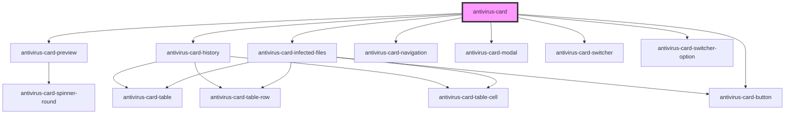

# antivirus-card

<!-- Auto Generated Below -->

## Properties

| Property           | Attribute | Description | Type                                                                          | Default     |
| ------------------ | --------- | ----------- | ----------------------------------------------------------------------------- | ----------- |
| `notifier`         | --        |             | `INotifier`                                                                   | `undefined` |
| `translateService` | --        |             | `{ currentLang: string; onLangChange: Observable<{ lang: "ru" \| "en"; }>; }` | `undefined` |

## Dependencies

### Depends on

- [antivirus-card-preview](preview)
- [antivirus-card-infected-files](infected-files)
- [antivirus-card-history](history)
- [antivirus-card-navigation](navigation)
- [antivirus-card-modal](modal)
- [antivirus-card-switcher](switcher)
- [antivirus-card-switcher-option](switcher-option)
- [antivirus-card-button](button)

### Graph

----------------------------------------------

*Built with [StencilJS](https://stenciljs.com/)*
