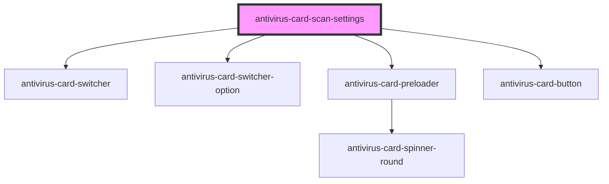

# antivirus-card-scan-settings

<!-- Auto Generated Below -->

## Properties

| Property              | Attribute | Description                 | Type         | Default     |
| --------------------- | --------- | --------------------------- | ------------ | ----------- |
| `closeModal`          | --        |                             | `() => void` | `() => {}`  |
| `preset` _(required)_ | --        | Model settings for new scan | `ScanOption` | `undefined` |

## Dependencies

### Depends on

- [antivirus-card-switcher](../switcher)
- [antivirus-card-switcher-option](../switcher-option)
- [antivirus-card-preloader](../preloader)
- [antivirus-card-button](../button)

### Graph

----------------------------------------------

*Built with [StencilJS](https://stenciljs.com/)*
