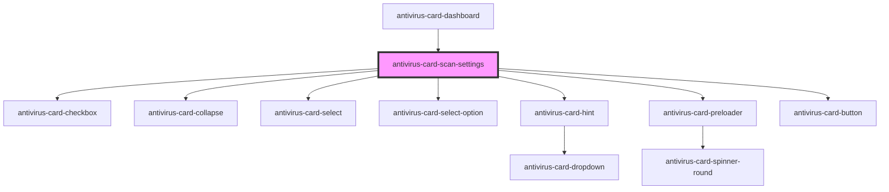

# antivirus-card-scan-settings

<!-- Auto Generated Below -->

## Properties

| Property     | Attribute | Description                  | Type         | Default    |
| ------------ | --------- | ---------------------------- | ------------ | ---------- |
| `closeModal` | --        | Method for click close modal | `() => void` | `() => {}` |

## Methods

### `setPreset(preset: ScanOption) => Promise<void>`

Method for set preset in modal

#### Returns

Type: `Promise<void>`

## Dependencies

### Used by

 - [antivirus-card-dashboard](../dashboard)

### Depends on

- [antivirus-card-checkbox](../checkbox)
- [antivirus-card-collapse](../collapse)
- [antivirus-card-select](../select)
- [antivirus-card-select-option](../select-option)
- [antivirus-card-hint](../hint)
- [antivirus-card-preloader](../preloader)
- [antivirus-card-button](../button)

### Graph

----------------------------------------------

*Built with [StencilJS](https://stenciljs.com/)*
