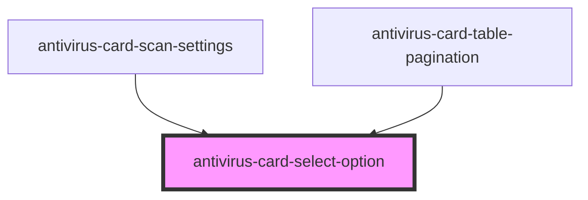

# antivirus-card-select-option

<!-- Auto Generated Below -->

## Properties

| Property   | Attribute  | Description                   | Type      | Default     |
| ---------- | ---------- | ----------------------------- | --------- | ----------- |
| `selected` | `selected` | Key for active selected value | `boolean` | `false`     |
| `value`    | `value`    | Option value                  | `any`     | `undefined` |

## Events

| Event                 | Description                     | Type                               |
| --------------------- | ------------------------------- | ---------------------------------- |
| `changedSelectStatus` | Event by change selected status | `CustomEvent<SelectedOption<any>>` |

## Dependencies

### Used by

 - [antivirus-card-scan-settings](../scan-settings)
 - [antivirus-card-table-pagination](../table-pagination)

### Graph

----------------------------------------------

*Built with [StencilJS](https://stenciljs.com/)*
