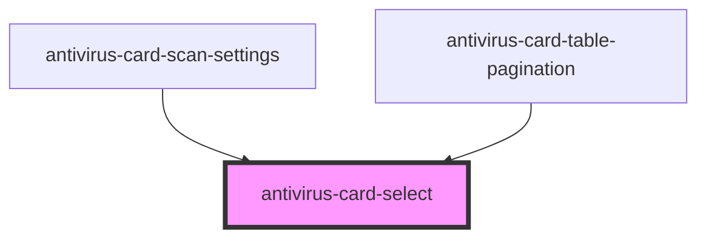

# antivirus-card-select

<!-- Auto Generated Below -->

## Properties

| Property        | Attribute     | Description                   | Type                  | Default     |
| --------------- | ------------- | ----------------------------- | --------------------- | ----------- |
| `borderless`    | `borderless`  |                               | `boolean`             | `undefined` |
| `disabled`      | `disabled`    | Disabled key for select field | `boolean`             | `undefined` |
| `placeholder`   | `placeholder` | Placeholder for select field  | `string`              | `undefined` |
| `selectedValue` | --            | Selected value                | `SelectedOption<any>` | `undefined` |
| `width`         | `width`       |                               | `number`              | `280`       |

## Events

| Event     | Description                      | Type               |
| --------- | -------------------------------- | ------------------ |
| `changed` | Handle for change selected value | `CustomEvent<any>` |

## Dependencies

### Used by

 - [antivirus-card-scan-settings](../scan-settings)
 - [antivirus-card-table-pagination](../table-pagination)

### Graph

----------------------------------------------

*Built with [StencilJS](https://stenciljs.com/)*
