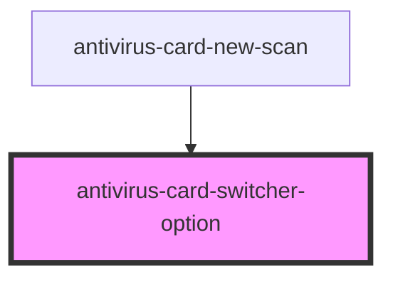

# antivirus-card-switcher-option

<!-- Auto Generated Below -->

## Properties

| Property           | Attribute           | Description | Type      | Default |
| ------------------ | ------------------- | ----------- | --------- | ------- |
| `active`           | `active`            |             | `boolean` | `false` |
| `disabled`         | `disabled`          |             | `boolean` | `false` |
| `last`             | `last`              |             | `boolean` | `false` |
| `selectedDisabled` | `selected-disabled` |             | `boolean` | `false` |

## Events

| Event      | Description | Type               |
| ---------- | ----------- | ------------------ |
| `selected` |             | `CustomEvent<any>` |

## Dependencies

### Used by

 - [antivirus-card-new-scan](../new-scan)

### Graph

----------------------------------------------

*Built with [StencilJS](https://stenciljs.com/)*
