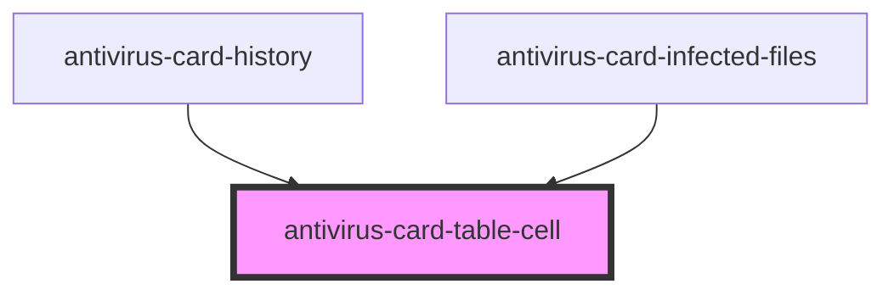

# antivirus-card-table-cell

<!-- Auto Generated Below -->

## Properties

| Property     | Attribute     | Description | Type      | Default     |
| ------------ | ------------- | ----------- | --------- | ----------- |
| `alignLeft`  | `align-left`  |             | `boolean` | `undefined` |
| `alignRight` | `align-right` |             | `boolean` | `undefined` |
| `doubleline` | `doubleline`  |             | `boolean` | `undefined` |
| `selected`   | `selected`    |             | `boolean` | `undefined` |
| `singleline` | `singleline`  |             | `boolean` | `undefined` |

## Dependencies

### Used by

 - [antivirus-card-history](../history)
 - [antivirus-card-infected-files](../infected-files)

### Graph

----------------------------------------------

*Built with [StencilJS](https://stenciljs.com/)*
