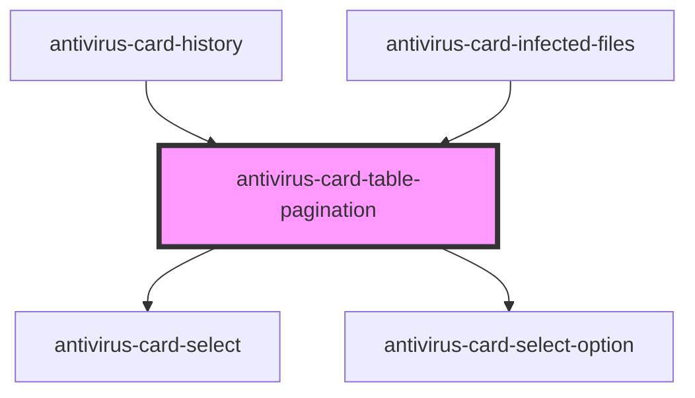

# antivirus-card-table-pagination

<!-- Auto Generated Below -->

## Properties

| Property            | Attribute       | Description | Type                                    | Default     |
| ------------------- | --------------- | ----------- | --------------------------------------- | ----------- |
| `changeCountOnPage` | --              |             | `(event: number) => void`               | `undefined` |
| `clickPagination`   | --              |             | `(event: "next" \| "previous") => void` | `undefined` |
| `countOnPage`       | `count-on-page` |             | `number`                                | `undefined` |
| `currentPage`       | `current-page`  |             | `number`                                | `undefined` |
| `disable`           | `disable`       |             | `boolean`                               | `undefined` |
| `disabled`          | `disabled`      |             | `boolean`                               | `undefined` |
| `pageCount`         | `page-count`    |             | `number`                                | `undefined` |

## Dependencies

### Used by

 - [antivirus-card-history](../history)
 - [antivirus-card-infected-files](../infected-files)

### Depends on

- [antivirus-card-select](../select)
- [antivirus-card-select-option](../select-option)

### Graph

----------------------------------------------

*Built with [StencilJS](https://stenciljs.com/)*
