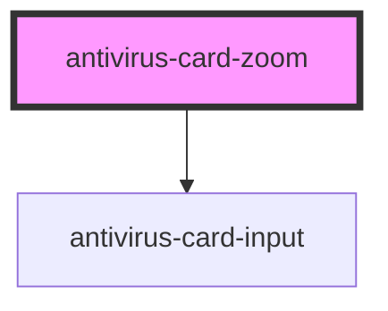

# antivirus-card-zoom

<!-- Auto Generated Below -->

## Properties

| Property      | Attribute       | Description                                 | Type       | Default |
| ------------- | --------------- | ------------------------------------------- | ---------- | ------- |
| `notDelCount` | `not-del-count` | The number of fields that cannot be deleted | `number`   | `0`     |
| `values`      | --              | Values for initial fields                   | `string[]` | `['']`  |

## Events

| Event     | Description         | Type                    |
| --------- | ------------------- | ----------------------- |
| `changed` | Change values event | `CustomEvent<string[]>` |

## Dependencies

### Depends on

- [antivirus-card-input](../input)

### Graph

----------------------------------------------

*Built with [StencilJS](https://stenciljs.com/)*
