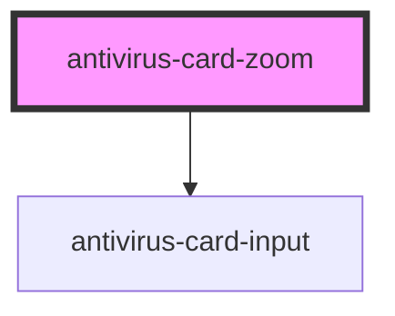

# antivirus-card-zoom

<!-- Auto Generated Below -->

## Properties

| Property | Attribute | Description                     | Type       | Default |
| -------- | --------- | ------------------------------- | ---------- | ------- |
| `values` | --        | Values for initial field values | `string[]` | `['']`  |

## Events

| Event     | Description         | Type                    |
| --------- | ------------------- | ----------------------- |
| `changed` | Change values event | `CustomEvent<string[]>` |

## Dependencies

### Depends on

- [antivirus-card-input](../input)

### Graph

----------------------------------------------

*Built with [StencilJS](https://stenciljs.com/)*
