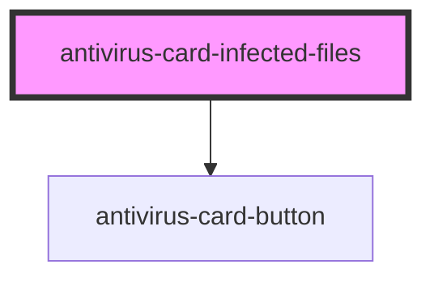

# antivirus-card-infected-files

<!-- Auto Generated Below -->

## Properties

| Property   | Attribute | Description | Type     | Default     |
| ---------- | --------- | ----------- | -------- | ----------- |
| `myObject` | --        |             | `object` | `undefined` |

## Dependencies

### Depends on

- [antivirus-card-button](../button)

### Graph

----------------------------------------------

*Built with [StencilJS](https://stenciljs.com/)*
