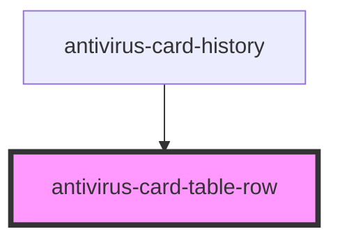

# antivirus-card-table-row

<!-- Auto Generated Below -->

## Properties

| Property      | Attribute      | Description | Type      | Default     |
| ------------- | -------------- | ----------- | --------- | ----------- |
| `actionHover` | `action-hover` |             | `boolean` | `undefined` |
| `disabled`    | `disabled`     |             | `boolean` | `undefined` |

## Dependencies

### Used by

 - [antivirus-card-history](../history)

### Graph

----------------------------------------------

*Built with [StencilJS](https://stenciljs.com/)*
