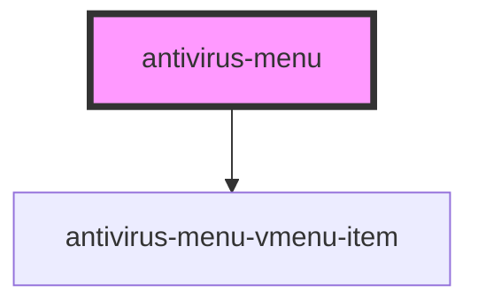

# my-component

<!-- Auto Generated Below -->

## Properties

| Property            | Attribute | Description | Type                                                                          | Default     |
| ------------------- | --------- | ----------- | ----------------------------------------------------------------------------- | ----------- |
| `routerChangeEvent` | --        |             | `Observable<any>`                                                             | `undefined` |
| `translateService`  | --        |             | `{ currentLang: string; onLangChange: Observable<{ lang: "ru" \| "en"; }>; }` | `undefined` |
| `url`               | `url`     |             | `string`                                                                      | `undefined` |

## Dependencies

### Depends on

- [antivirus-menu-vmenu-item](../vmenu-item)

### Graph

----------------------------------------------

*Built with [StencilJS](https://stenciljs.com/)*
