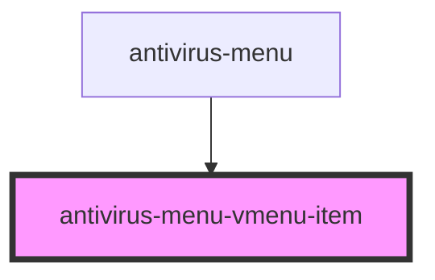

# ngispui-vmenu-item

<!-- Auto Generated Below -->

## Properties

| Property   | Attribute   | Description | Type      | Default     |
| ---------- | ----------- | ----------- | --------- | ----------- |
| `active`   | `active`    |             | `boolean` | `undefined` |
| `disabled` | `disabled`  |             | `boolean` | `undefined` |
| `iconOnly` | `icon-only` |             | `boolean` | `undefined` |

## Dependencies

### Used by

 - [antivirus-menu](../antivirus-menu)

### Graph

----------------------------------------------

*Built with [StencilJS](https://stenciljs.com/)*
